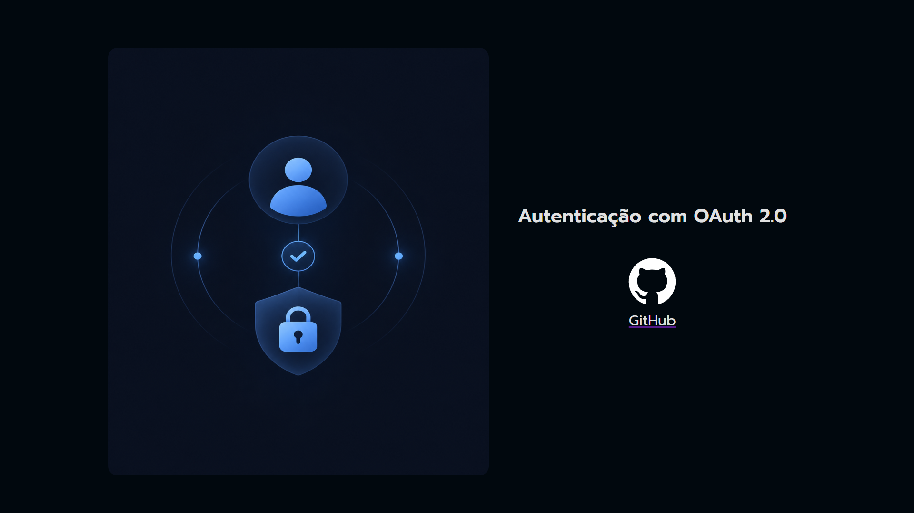
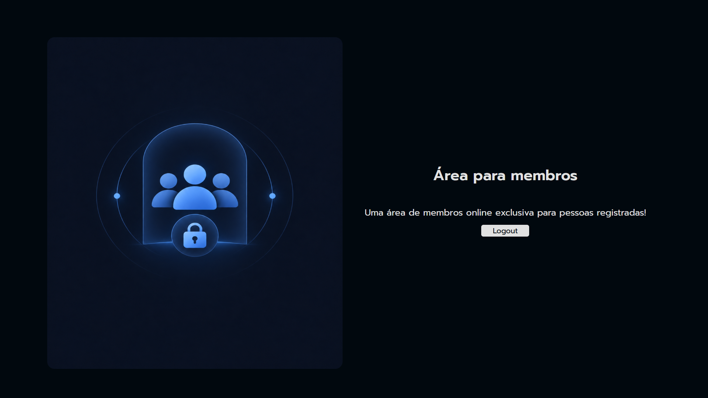

# Autenticação OAuth com Django

Projeto desenvolvido durante um curso da **Alura**, com foco na implementação de autenticação **OAuth 2.0 com GitHub** em uma aplicação Django.

A aplicação permite realizar login com uma conta do GitHub e acessar uma área exclusiva para usuários autenticados. Também possui logout com redirecionamento para a página inicial.

## Funcionalidades

- Login com GitHub utilizando OAuth 2.0
- Integração com `django-allauth`
- Área exclusiva para usuários autenticados
- Proteção de rota com `login_required`
- Redirecionamento após o login
- Logout com retorno à página inicial
- Gerenciamento de usuários e contas sociais pelo Django Admin
- Uso de arquivos estáticos para estilização da aplicação

## Tecnologias

- Python
- Django
- django-allauth
- OAuth 2.0
- GitHub OAuth
- HTML
- CSS

## Screenshots

### Página inicial



### Área de membros



## Variáveis de ambiente

O projeto utiliza um arquivo `.env` para armazenar informações sensíveis:

```env
SECRET_KEY=
GITHUB_CLIENT_ID=
GITHUB_CLIENT_SECRET=
```

## Sobre o projeto

Este projeto foi desenvolvido como parte dos estudos de Django na Alura. O objetivo principal foi praticar a integração de autenticação social com provedores externos por meio de OAuth 2.0 e django-allauth, utilizando o GitHub como exemplo, além da proteção de páginas para usuários autenticados e do fluxo de login e logout.